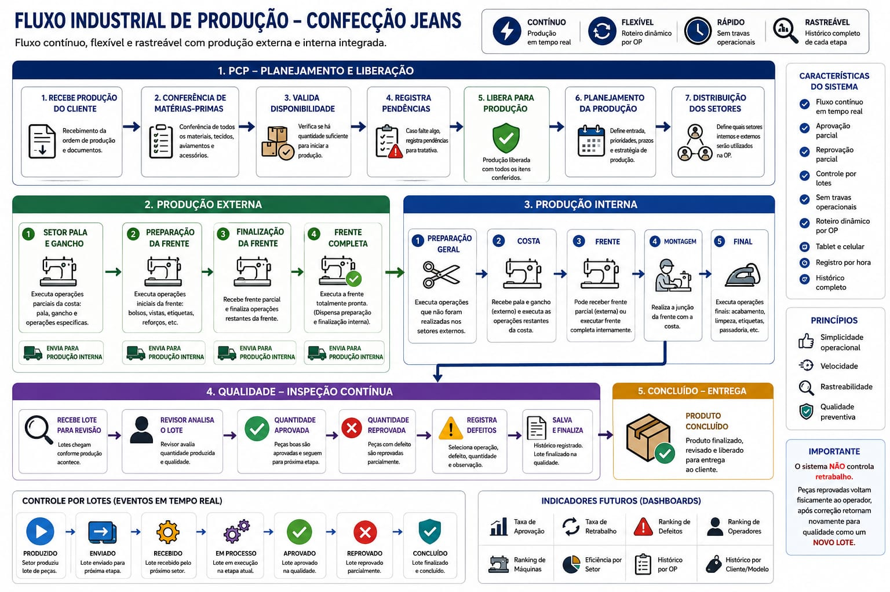

# Fluxo Industrial Completo

O sistema deve funcionar com fluxo industrial flexível, dinâmico e não linear.

## Objetivo

Controlar produção interna e externa em tempo real, permitindo rastreabilidade
completa das etapas produtivas sem engessar o fluxo operacional.

## Conceito Principal

Cada OP pode possuir roteiros diferentes de produção.

O sistema não deve possuir:

- Setores obrigatórios
- Sequência fixa
- Fluxo rígido

Cada OP define dinamicamente:

- Setores utilizados
- Ordem operacional
- Distribuição da produção

## Módulo PCP

1. Receber produção do cliente.

2. Conferir:

   - Tecidos
   - Aviamentos
   - Etiquetas
   - Botões
   - Rebites
   - Zíper
   - Linhas
   - Demais materiais

3. Validar disponibilidade dos insumos.

4. Registrar pendências de materiais.

5. Após conferência, liberar produção.

6. Planejar:

   - Entrada da produção
   - Distribuição operacional
   - Setores envolvidos
   - Estratégia produtiva

## Produção Externa

1. Setor Pala e Gancho.

   Executa:

   - Pala
   - Gancho
   - Operações parciais da costa

2. Preparação da Frente.

   Executa:

   - Operações iniciais da frente

3. Finalização da Frente.

   Recebe:

   - Frente parcial

   Finaliza:

   - Operações restantes

4. Frente Completa.

   Executa:

   - Frente totalmente pronta

## Produção Interna

1. Preparação Geral.

   Executa:

   - Operações não realizadas externamente

2. Costa.

   Recebe:

   - Pala/ganchos externos

   Executa:

   - Operações restantes da costa

3. Frente.

   Pode:

   - Finalizar frente parcial externa
   - Executar frente completa internamente

4. Montagem.

   Executa:

   - Junção frente + costa

5. Final.

   Executa:

   - Acabamento
   - Limpeza
   - Fechamento final

6. Qualidade.

   Executa:

   - Revisão contínua
   - Aprovação parcial
   - Reprovação parcial
   - Rastreabilidade

7. Concluído.

   Produto finalizado e liberado.

## Requisitos Importantes

- Fluxo configurável por OP
- Produção parcial
- Controle por lotes
- Produção contínua
- Qualidade paralela
- Sem travas operacionais
- Tablet e celular
- Histórico completo
- Registro por hora
- Controle de eventos produtivos

## Estados Controlados

O sistema deve controlar:

- Produzido
- Recebido
- Em processo
- Aprovado
- Reprovado
- Concluído

## Indicadores Futuros

- Eficiência por setor
- Tempo por operação
- Gargalos
- Ranking produção
- Ranking defeitos
- Histórico por OP
- Histórico por cliente
- Eficiência produção externa
- Eficiência produção interna

O sistema deve funcionar como uma plataforma industrial moderna de produção
flexível para confecção jeans.
